# CRUD Basics

Whenever you access things in MongoDB, be it either DB, or collection, then those things get created implicitly. 

There is a way to create them explicitly as well with commands. Ex. `db.createCollection()`.

Before running any operation to operate on data, you need to select a DB.
```bash
use flights
```

This will not create a DB straight away, as it needs to get data in it before it gets generated.

After selecting your DB, you need to run operations on a collection.
```bash
db.flightData.insertOne({
    "departureAirport": "MUC",
    "arrivalAirport": "SFO",
    "aircraft": "Airbus A380",
    "distance": 12000,
    "intercontinental": true
})
```

Now with data in a collection within the DB, you can see that the DB has been created.

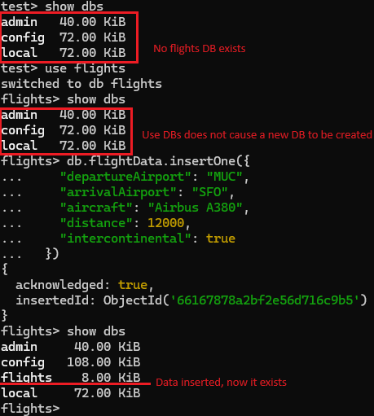

When you insert data into MongoDB, then you can see that it will automatically insert an ID to the entry.

The automatically generated ID contains 24 hexadecimal characters. A hexadecimal character is 4 bits, so a total of 96 bites, totalling 12 bytes. 

They are sortable by timestamp, as the info is contained with in the ID.

The ID consists of:
* A 4-byte timestamp, representing the ObjectId's creation, measured in seconds since the Unix epoch.
* A 5-byte random value generated once per process. This random value is unique to the machine and process.
* A 3-byte incrementing counter, initialized to a random value.

You can also provide the ID manually when doing the insert by setting a value via the `_id` property when inserting.

MongoDB has single or batch operations for CRUD. 

The commands which operate on a single document will run it on the first match. Ex. `deleteOne` will delete the first match.

When running operations, you might notice things that start with a dollar sign (`$`). These are reserved keywords/operators in MongoDB.

## Create

### `db.collection.insertOne(data, options)`

When not providing an ID, then it gets automatically generated.

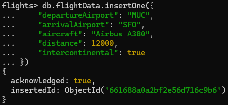

However, when providing an ID, then it uses the provided one as is.

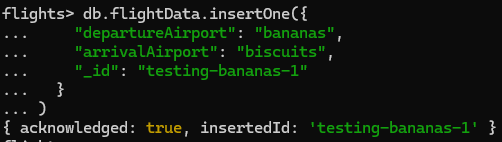

### `db.collection.insertMany(data, options)`

Can provide an array as the data parameter here.

Returns results for all of the arrays.

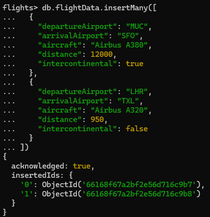

## Read

### `db.collection.find(filter, options)`

Note that this returns an array.

When trying to find, then you can use the filter to get all the documents that match the query.

However, when you're querying by generated ID, then you're going to want to wrap it in ObjectId, because otherwise it will not be found.

Notice how the result is empty for the query without the ObjectId.

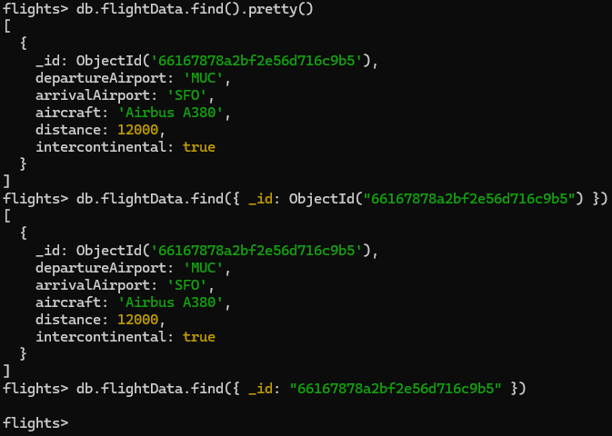

However, if you have entries with custom IDs, then you can provide the ID as is.

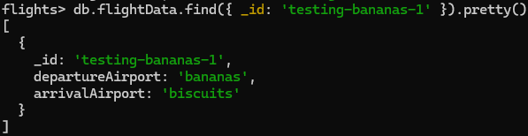

You can also provide partial matches for finding. There are [a whole bunch of operators that could be used](https://www.mongodb.com/docs/manual/reference/operator/query/#std-label-query-projection-operators-top).

In the example, it's doing a greater than on a number.

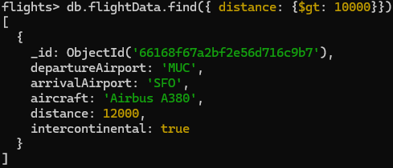

In the real world, you'll have a situation where a single `find` call might not necessarily fit all of the entries in one call.

`find` returns a cursor object. It has a whole bunch of different methods from it.
 The `pretty` method that has been used previously is a method that exists on the cursor. That's why you can't call `pretty` on `findOne`.

If you want to get all of the results in one query, then there are a bunch of methods that can be called on the cursor. Refer to the drivers for the specifics. 
For example, you can append `toArray()` to find to get all of the matches. Or you can iterate through all of them with a `forEach()`.

Refer to the "Projection" section to see how to filter data.

### `db.collection.findOne(filter, options)`

Note that this returns a single object or null.

Same rules apply to `findOne` as `find`, except this will only return the first match.

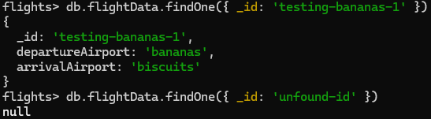

## Update

### `db.collection.updateOne(filter, data, options)`

Updates a single element.

First we provide what data we want to update.

In the data parameter, we need to provide the update operator that we want to use. There are a [couple options](https://www.mongodb.com/docs/manual/reference/operator/update/#std-label-update-operators).

In this example, the `$set` operator is used, which updates a field or adds it.

The opposite of that would be `$unset`, which removes a field.

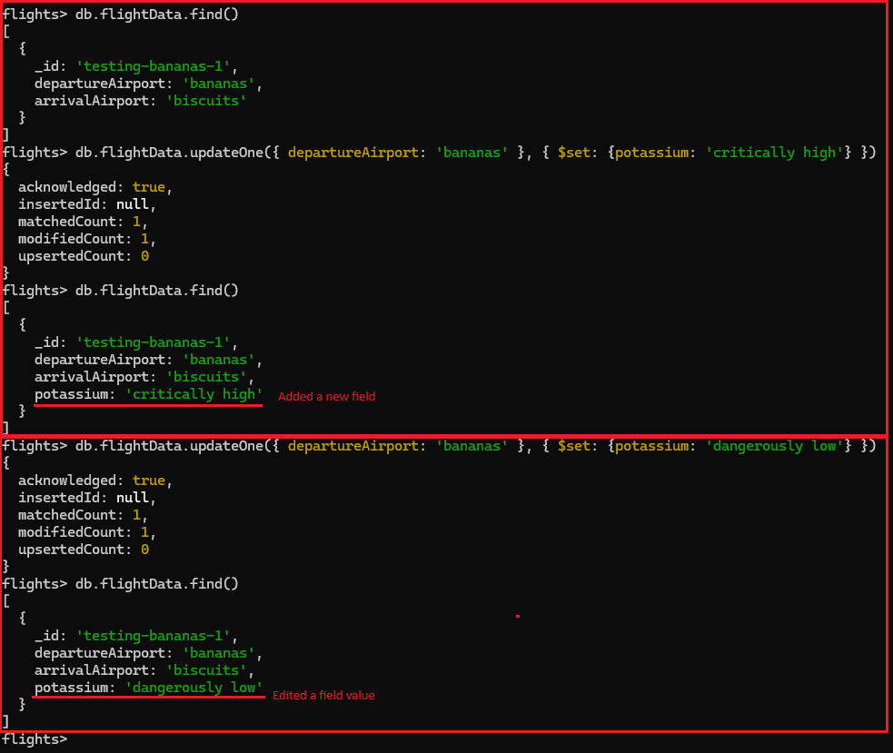

### `db.collection.updateMany(filter, data, options)`

Update many operators the same way as `updateOne`, but in batch.

### `db.collection.replaceOne(filter, data, options)`

Allows fully replacing the matched entry.

Note how you can't change the ID.

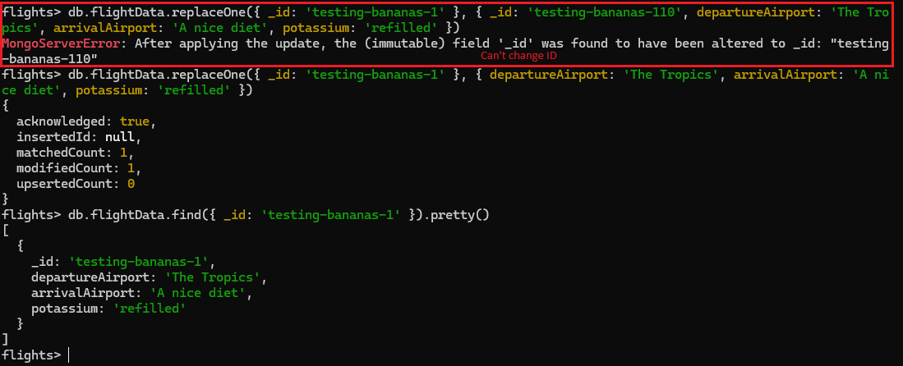

## Delete

### `db.collection.deleteOne(filter, options)`

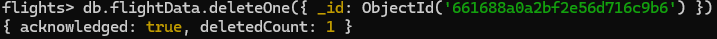

### `db.collection.deleteMany(filter, options)`

This method requires parameters to be provided. An error will be provided when running this with no params.

However, if you want to run batch operations using it, then you can provide an empty object as the first parameter, which will delete all documents in the collection.

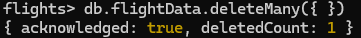

## Projection

Projection is something that can be used to filter down data on the server, thus avoiding sending it over the wire. Get only as much as you need.

The `find` method has a second parameter, through which you can specify what fields do you want to get.

In order to define what properties to include or exclude, you have to use either 1 or 0 for the property.

If you define a property with 1, then that means only that property is allowed.

If you define a property with 0, then that means everything except that property will be queried.

If you don't explicitly state that `_id` is excluded, then it's queried.

Notice that if the property does not include the property, then an empty object will still be present.

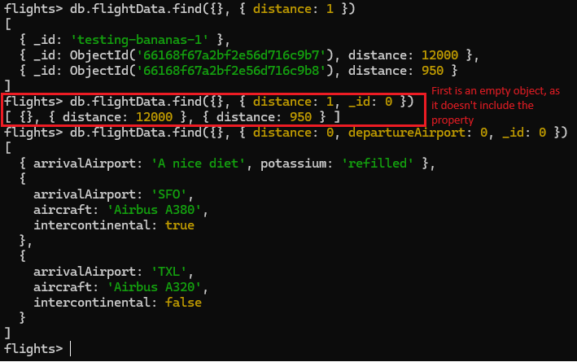

## Embedded documents

A document is a row in MongoDB. Embedded document means nested objects, arrays etc.

You can have up to 100 levels of nesting in embedded documents.

The overall document size has to be under 16 MB.

When querying for the data, you need to use the dot notation to drill into your documents.

When drilling in, then you need to wrap the key in quotation marks.
`db.flightData.find({ "status.details.responsible": 'Albert Einstein' })`

You can search by array value by simply providing one of the values.
`db.flightData.find({ "status.details.preferences": 'fish' })`