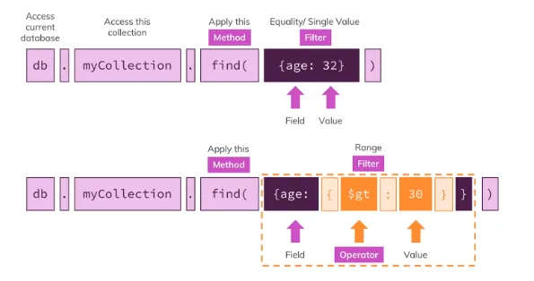
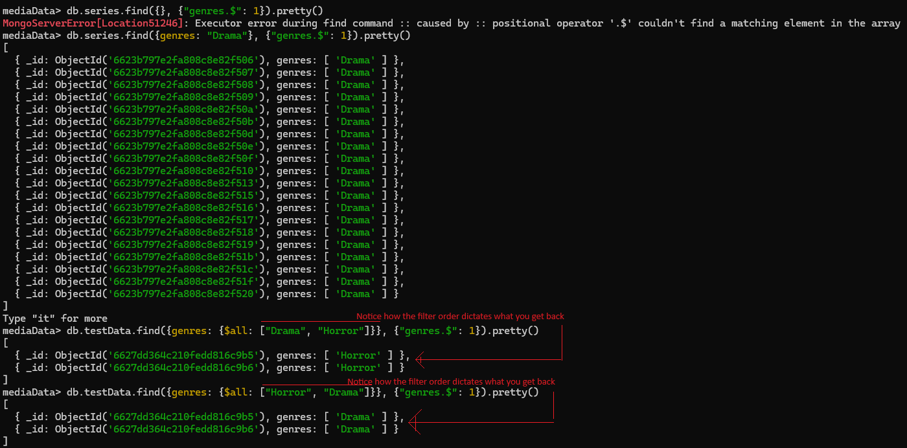
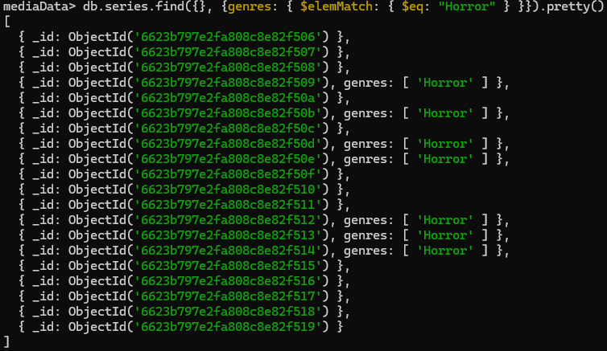
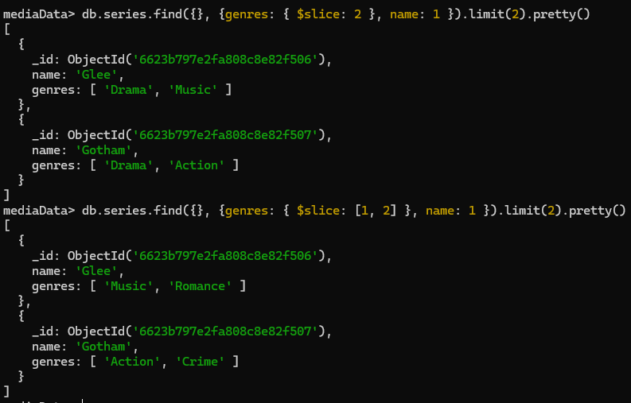

# Exploring read



Refresher:
* `findOne` to find one. Returns the first match
* `find` to find many

They both work exactly the same way with the examples below.

## Operators

| Type                | Purpose                      | Changes data? | Example |
|---------------------|------------------------------|---------------|---------|
| Query operator      | Locate data                  | No            | $eq     |
| Projection operator | Modify data presentation     | No            | $       |
| Update operator     | Modify + add additional data | Yes           | $inc    |

### Query operator

For query operators, you have a bunch of different subcategories:
* Comparison
* Evaluation
* Logical
* Array
* Element
* Comments
* Geospatial

The default, most intuitive syntax you'd use is:
```bash
db.series.find({ runtime: 60 })
```

The above would search by equality.

Now, if you want to specify different filters, then you have to provide an object for the parameter.

Though, you could do the exact same query by doing this:
```bash
db.series.find({ runtime: { $eq: 60 } })
```

There are a bunch of operators that you can use, and you should refer to the docs for them. But a few examples are below:

Not equal:
```bash
db.series.find({ runtime: { $ne: 60 } })
```

Lower than:
```bash
db.series.find({ runtime: { $lt: 40 } })
```

If you're looking at a nested document, then you'd use the path as a string:
```bash
db.series.find({ "rating.average": { $gt: 7 } })
```

If you're going for a value contains in a primitive array, then it's the same as with equaling a regular value:
```bash
db.series.find({ genres: 'Drama' })
```

If you want the array to contain only the values that you specify, then you can use brackets:
```bash
db.series.find({ genres: [ 'Drama' ] })
```

To look at equality of multiple values (is one or the other), then `$in` can be used:
```bash
db.series.find({ runtime: { $in: [30, 42] } })
```

The inversion of `$in` would be `$nin`.

To check for multiple values, then you need an OR statement, for that `$or` can be used. Unlike the previous ones, you don't start with the field name, but with the `$or` clause:
```bash
db.series.find({
    $or: [
        { "rating.average": { $lt: 5 } },
        { "rating.average": { $gt: 9.3 } }
    ] 
}).pretty()
```

If you want to invert the OR, then you can use `$nor`, meaning none of the conditions are met.

To do AND, you can use simpler syntax:
```bash
db.series.find({
    { "rating.average": { $gt: 9.3 } },
    { genres: 'Drama' }
}).pretty()
``` 

You can also use longer, more complicated syntax:
```bash
db.series.find({
    $and: [
        { "rating.average": { $gt: 9.3 } }
        { genres: 'Drama' },
    ] 
}).pretty()
```

However, the above does come handy with things like multiple values in an array:
```bash
db.series.find({
    $and: [
        { genres: 'Horro' }
        { genres: 'Drama' },
    ] 
}).pretty()
```

`$not` is something that exists to invert a query, however, you'll likely have a better option. E.g. `$nor` vs `$or`.
```bash
db.series.find({ runtime: { $not: { $in: [30, 42] } } })
```

For contains, a not-so-performant solution would be to use a regex statement. However, you'd probably want to turn to indexes in real life:
```bash
db.series.find({ summary: { $regex: { /musical/ } } })
```

#### Expression

To compare two fields inside one document you can use `$expr`.
For example, get all the sales where volume exceeded target.
There are certain comparison operators you can use inside of `$expr`, so double check with the documentation. There are additional syntactic specificities. If you want to specify that fields should be looked at, then they must be pre-pended with a `$`:
```bash
db.sales.find({ $expr: { $gt: ["$volume", "$target"] } })
``` 

For more complicated comparisons, you can use extra operators. In the blow, there is a conditional first value calculation (`$volume`), and then it's compared to a second value (`$target`):
```bash
db.sales.find({ $expr: {
    $gt: [
        {
            $cond: {
                if: {
                    $gte: ["$volume", 190]
                },
                then: {
                    $subtract: ["$volume", 10] <-- subtract 10 from volume
                },
                else: "$volume"
            }
        },
        "$target"
    ] 
}})
```

#### Array operators

There are a bunch of helper operators that help with working with arrays.

When you have objects in arrays, then you're going to need operators. If you provide it with just regular objects, then it'll look for exact shape and value equality. E.g. the object has two fields, you provide a single one, that's going to be a mismatch.

The below would search for an array of hobbies for objects inside of it, which contain the string "Sports".

```bash
db.users.find({ "hobbies.title": "Sports" })
```

You can search by array length by using `$size`. You can't do greater than etc in this one. Only exact matches.
```bash
db.users.find({ hobbies: {$size: 3} })
```

If you want to find arrays with partial equality, then you can use the `$all` operator. It doesn't care about order.
```bash
db.moviestarts.find({ genre: { $all: ["action", "thriller"] } })
```

In order to match specific array elements with multiple matching properties, you can use the `$elemMatch` operator. The below is operating on a "hobbies" array, which contains an object with properties "title" and "frquency":
```bash
db.users.find({ hobbies: { $elemMatch: {
    title: "Sports",
    frequency: {
        $gte: 3 
    }
} } })
```

#### Checking the schema

Since NoSQL DBs don't necessarily need to have the same shape for each document inside the collection, then there are some selectors to get documents with certain shapes.

One such example is checking whether a property exists or not:
```bash
db.users.find({ age: {$exists: true} })
``` 

For the above, if the value is set to `null`, then it would still return, as the property exists, the value is simply missing.

To filter out `null` values, you can combine filters:
```bash
db.users.find({ age: {
    $exists: true,
    $ne: null
}})
```

You have a filter for type using `$type`:
```bash
db.users.find({ phone: { $type: "number" } })
```

### Cursor

A cursor is something that keeps track of the last thing your query returned, and on the next call will return a new set. You can use it to return data in batches, so just like pagination.

In order to sort your results, you can use the `sort` method on the cursor.

```bash
db.movies.find().sort({ "rating.average": 1, runtime: -1 }).pretty()
```

To jump over elements, you can use the `skip` method. You specify the number of elements you want to skip, not pages.

```bash
db.movies.find().skip(10).pretty()
```

In order to specify how many elements you get with one batch, you can use the `limit` function.

In the shell, the order in which you call the methods does not matter. In the drivers, it's different, though.

```bash
db.movies.find().limit(10).skip(100).pretty()
```

### Projection operators

For projection operators, you have a bunch of different ones:
* $
* $elemMatch
* $meta
* $slice

With projection, you're trying to send less data over the wire. The easiest form is to set a property equal to 1 or 0 to include/exclude it.

However, you can write more complex logic using the operators.

#### $ - first match in array

`$` is used to get the first element in a array. You have to have written a filter statement for the array.

If you don't have an array filter statement, then you'll get an error.

When you write a simple filter statement like `genres: "Drama"`, then it'll return only "Drama" entries in the data.

However, if you have something more complex like checking for multiple matches with `$all: ["Drama", "Horror"]`, then you'll notice that it only returns "Horror", this is because it depends on the filter order. The last matching element of the filter is the one that you will be getting back.



#### $elemMatch

To get elements out of an array that you might not have queried for, then you can use the `$elemMatch` operator.




#### $slice

This operator can be used to:
* Get the first N elements
* Get N elements, but skip the first M elements

