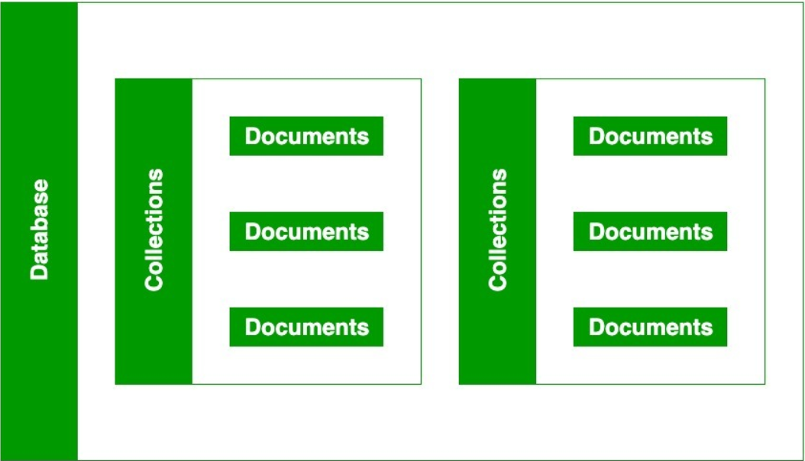
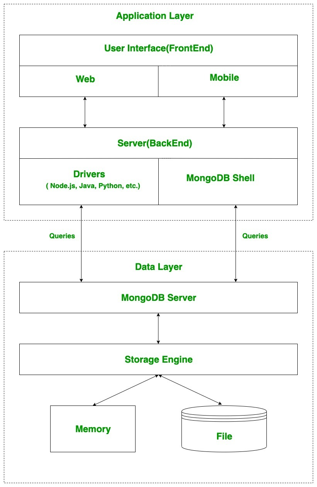

# MongoDB Introduction

MongoDB is a NoSQL database solution.

A single MongoDB server can run multiple databases on it.

Each database is made up of collections.

Each collection contains documents, which are individual rows.

A document is basically JSON. Technically data is stored as BSON, which is a binary representation of JSON. But for all intents and purposes, you'll only see JSON.

Just like JSON, you can nest objects.

As any other NoSQL solution, it is schemaless and there are no joins like in SQL.

## SQL to MongoDB terminology

When translating it into SQL jargon, then:
* DB -> DB
* Tables -> Collections
* Rows -> Documents
* Columns -> Fields

## MongoDB ecosystem

The company behind MongoDB, which is also called MongoDB offers different solutions.

The main asset is MongoBD naturally.

There are different tools for analyzing data and to make managing the DB easier.

There's also Stitch, which is a serverless solution on top of MongoDB.

## Interacting with MongoDB

You can interact with a MongoDB instance using the shell commands or drivers.

Drivers are bridges between your programming language and the MongoDB server.

A lot of the syntax matches what you're using in the shell, with some slight deviations here and there.

The MongoDB process doesn't actually directly write the files onto disk, but it interacts with a storage engine, for which there is a default implementation, but it could be swapped out. The default is WiredTiger.

Different workloads require different storage strategies, so that is what the storage engine provides.

As reading and writing from disk is slower than from in-memory, then it also has an in-memory cache.

It keeps things more often used in the in-memory portion.

