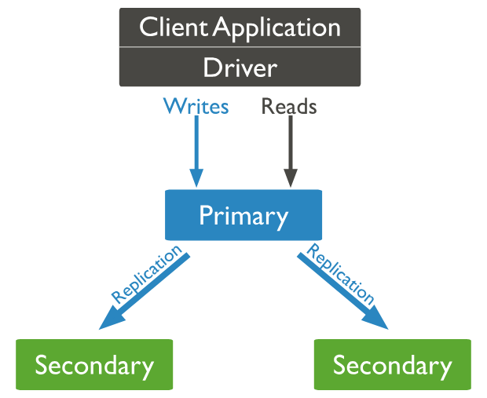

# Performance, Fault Tolerancy

## Capped collections
A capped collection is a type of collection that'll only store a certain amount of documents.
Old documents will be deleted when the size is exceeded.

To create this, you can use options when creating a collection:

```js
db.createCollection(
    "someCollection",
    {
        // To turn it into a capped collection
        capped: true,
        // Size cap in bytes
        size: 10_000,
        // Maximum number of documents
        max: 3
    }
)
```

## Replica sets

Replica sets allow asynchronously duplicating data from the primary node to secondary nodes.

You could distribute read requests across the different nodes.



## Sharding

Sharding means having bits of the data in different units. You assign shards to machines and each machine will serve their shard.

Mongo provides a router that can be used for routing to the correct shard - mongos.

You have to add a shard key so that the router would understand where to route.

If a find operation does not contain the shard key, it'll broadcast the query to all shards.

If a find operation does contain the shard key, it'll target the correct shard.