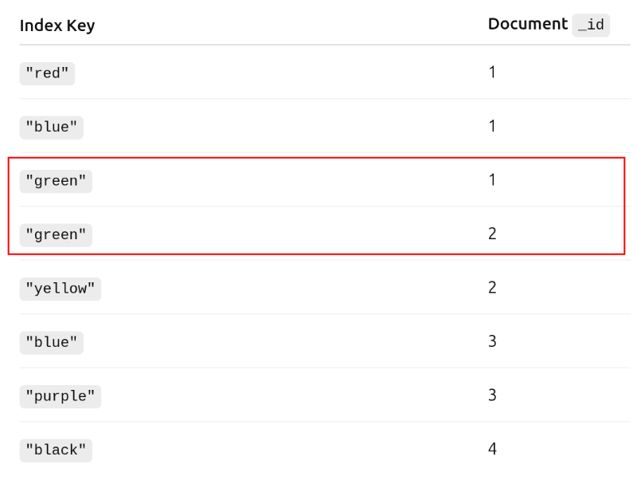
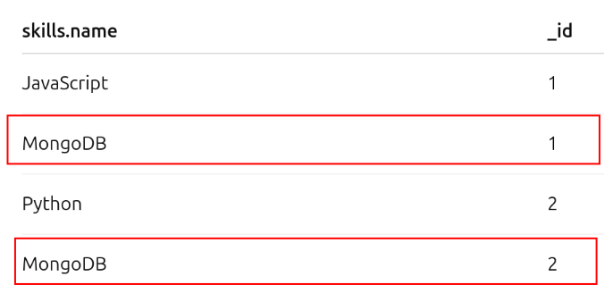

# Working with indexes

Indexes speed up our queries, but at the cost of write latency, and storage usage.

## Explain

You can use `explain` to see what did MongoDB do to execute the operation.

```js
db.customers.explain().findOne({ 'dob.age': { $gt: 60 } });
```

You can also pass parameters into `explain()` to define how verbose you want it to be.

## Create and remove indexes

You can define an index using `createIndex()`.

You can specify whether it's ascending (1) or descending (-1).

Whether you use ascending or descending is dependent on the usual sort order you use when querying.

```js
db.contacts.createIndex({ 'dob.age': 1 })
```

You can drop an index with `dropIndex`.

```js
db.contacts.dropIndex({ 'dob.age': 1 })
```

With an index, you can see in the executionStages that it'll:
1. Do an IXSCAN (index scan), which gets the pointers to the documents
2. Then do a fetch for the documents' data

If you have a query where you're returning most of the collection data,
then it can actually be slower if there's an index.

This is because it has to go through the entire index structure, and then the entire table.

Without an index, it wouldn't go through the index.

So if you're returning most of the data with your queries, you might not want to add an index.

## Compound index

If you're doing operations on low cardinality field, then a regular index might be pointless as well.
But a compound index might make more sense.

A compound index combines multiple fields into its indexes.

The order in which you define these matter.
It'll either try matching 33-male or male-33.

```js
db.contacts.createIndex({ 'dob.age': 1, gender: 1 })
```

You can re-use the same index for querying simply by age.

But if you'd simply query by gender, then that index would not be used.

So re-use matters from left to right.

When defining your compound index, you should set the more selective field first.

So ID for example is very selective. In the above example, gender would only reduce the set by 50%.
So it'd be more beneficial to first filter by age, and then gender.

## Sorting

If you do a sort on a large amount of documents you might run into issues.

MongoDB can only keep a certain amount of documents in memory, if there's no index, then for sorting it'll have to pull all data into memory and start sorting.

MongoDB can time out when it reaches its limit and there's no index for sorting.

## Default index

A default index that Mongo adds to a collection is on the _id field.

## Configuring indexes

The second parameter in createIndex allows configuration of the index.

### Unique index
For example, if you'd want a unique index, you can add `unique: true`

```js
db.contacts.createIndex({ email: 1 }, { unique: true })
```

However, if you have multiple values that do not have an email value, then you'll get an error.

MongoDB treats non-existent values as unique.

### Partial index

Partial indexes are a way to create smaller indexes.

```js
db.contacts.createIndex({ "dob.age": 1 }, { partialFilterExpression: { gender: "male" } })
```

It saves latency on write and disk space, because it won't have to index all females as well.

Also, if you're writing a new female into the table, then it won't need to be indexed.

Partial index makes sense if you often query by the same combination.

So with the above, it would make sense if you didn't query for females very often.

### Combining partial and unique

As MongoDB considers missing value as unique, then you might want to filter out missing values.

For example with an optional email:

```js
db.contacts.createIndex(
    { email: 1 },
    { 
        unique: true,
        partialFilterExpression: {
            email: {
                $exists: true
            }
        }
    }
)
```

### TTL index

TTL indexes help with automatically destroying entries.

It only works on date fields.

It also does not delete elements in hindsight, unless you add a new element.
So any element that was present before the index will not be expired.

However, if you insert, then Mongo will re-evaluate the collection.

```js
db.sessions.createIndex({ createdAt: 1 }, { expireAfterSeconds: 10 })
```

## Evaluating

Generally IXSCAN beats COLLSCAN. But there are situations where it doesn't.

To analyze the results, you should look at:
* Milliseconds process time to see how long they took.
* Number of keys (in index) examined, which should be as close as possible to number of documents examined.
* Number of documents examined, which should be as close as possible to number of documents returned. 

## Covered queries

If you query just for the fields that are covered by your indexes, then you won't hit the main collection.

It'll get all it needs from the index.

For example:

```js
db.customers.createIndex({ name: 1 });

// Picking just the fields that are indexed will make it so
// MongoDB will avoid looking at the main collection and
// Just get the data from the index
db.customers.find({ name: 'Steve' }, { _id: 0, name: 1 });
```

## Rejecting a plan

If you have multiple index - e.g. a single index and a compound index, then Mongo will consider both.

If you're filtering by multiple fields, then it'll look at the single index, reject it, and then use the compound.

Mongo lets plans run in parallel to look at a small subset of data.

The one that reaches the goal faster will win.

To avoid doing it constantly, it'll save the winning plan in the cache for that kind of query.

The cached winning plan will be removed after certain conditions:
* Certain number of writes have happened to the collection (currently 1000)
* Index is rebuilt (drop and recreate)
* If you add/remove other indexes, as those might now be better
* On MongoDB server restart

## Multikey index

A multikey index is an index used to support queries on array fields.

When you index an array field, MongoDB creates a separate index entry for each element of the array.

The way that it indexes depends on the complexity of the array and the index.

They are generally bigger than regular indexes.

Easiest example: strings in an array.

```js
db.people.insertMany([
    { _id: 1, name: "Alice", tags: ["red", "blue", "green"] },
    { _id: 2, name: "Bob",   tags: ["green", "yellow"] },
    { _id: 3, name: "Cara",  tags: ["blue", "purple"] },
    { _id: 4, name: "Dan",   tags: ["black"] }
])

db.people.createIndex({ tags: 1 })
```

It will take all available values, and create a mapping for them.

It doesn't remove duplicate values, when creating the mapping.



More complex example: objects in an array and indexing the array.

```js
db.users.insertMany([
  {
    _id: 1,
    name: "Alice",
    skills: [
      { name: "JavaScript", level: "intermediate" },
      { name: "MongoDB", level: "advanced" }
    ]
  },
  {
    _id: 2,
    name: "Bob",
    skills: [
      { name: "Python", level: "beginner" },
      { name: "MongoDB", level: "beginner" }
    ]
  }
])

db.users.createIndex({ skills: 1 })
```

In this example, each object gets indexed as a unit. So something like:

```
{ name: "JavaScript", level: "intermediate" } → _id: 1
{ name: "MongoDB", level: "advanced" }        → _id: 1
```

In this case it'll only work if you query by all the fields of the object.

If you try to query just by name, then it'll be ignored.

Most complex example: objects in an array and indexing nested fields.

```js
db.users.insertMany([
  {
    _id: 1,
    name: "Alice",
    skills: [
      { name: "JavaScript", level: "intermediate" },
      { name: "MongoDB", level: "advanced" }
    ]
  },
  {
    _id: 2,
    name: "Bob",
    skills: [
      { name: "Python", level: "beginner" },
      { name: "MongoDB", level: "beginner" }
    ]
  }
])

db.users.createIndex({ "skills.name": 1 })
```

The index mapping that it'll result in is the same as for the simplest example.

Each value gets a reference, uniqueness filtering does not get applied.



When choosing which approach to use, think of your access patterns:
* If you're querying by one field sometimes and both fields other times, then a compound.
* If you're always querying by the full object, then just index the array.

When creating compound indexes for the parent document, then those can only contain a single multikey index.

If you have a document with multiple arrays, then you cannot create a compound index that considers both of those arrays.

## Text index

MongoDB supports indexing text as well.

Notice it's not 1 or -1, but 'text' that you use to define it.

```js
db.products.createIndex({ description: 'text' });
```

To drop it, you need to specify a name.

```js
db.products.dropIndex('description_text');
```

When searching, you can use a special directive `$text`.

Notice that you don't have to specify the field that you're searching on.

Since text indexes are pretty expensive, then Mongo allows you to have a single text index in the collection.

```js
db.products.find({ $text: { $search: 'awesome' }})
```

If you add a space, then it searches for both words, not the phrase.

```js
// Will return results for 'red' and 'book'
db.products.find({ $text: { $search: 'red book' }})
```

If you want to search for the string as a phrase, then you can wrap it in quotes:

```js
// Will search for 'red book'
db.products.find({ $text: { $search: '"red book"' }})
```

When MongoDB queries from those indexes, then it also assigns a score for the results.

In order to see the score, you can use a specific keyword.
`$meta: { "textScore" }`

So to see it, you can add it into a projection.

```js
db.products.find(
    { $text: { $search: 'red book' }},
    { entryScore: { $meta: "textScore" } }
)
```

To sort by it, you still need to use that exact same syntax.
The name doesn't matter.

```js
db.products.find(
    { $text: { $search: 'red book' }}
).sort({ score: { $meta: "textScore" } })
```

You can also create a compound index with multiple fields.

```js
db.articles.insertMany([
  {
    title: "MongoDB Basics",
    body: "MongoDB is a NoSQL database that stores data in documents."
  },
  {
    title: "Advanced MongoDB Performance",
    body: "Indexing, aggregation, and replication are key to performance."
  },
  {
    title: "Text Search in MongoDB",
    body: "MongoDB supports text indexes for searching text fields efficiently."
  },
  {
    title: "Other NoSQL Databases",
    body: "Redis and Cassandra are also popular NoSQL databases."
  },
  {
    title: "Random Tech Ramblings",
    body: "Sometimes I just like to talk about nothing in particular. For example, indexes and documents."
  }
])

db.articles.createIndex({ title: "text", body: "text" })
```

Any searching will check both fields.

To exclude a word in the search, you can add a minus in front of the word.

```js
db.articles.find(
    { $text: { $search: 'documents -indexes' }},
)
```

When creating a text index, you can specify a default language. By default, it chooses English.
There's a list of supported languages.

It will define how the text is stemmed and stop-word removing.

```js
db.articles.createIndex(
    { title: "text", body: "text" },
    { default_language: "german" }
)
```

You can also specify different weights

```js
db.articles.createIndex(
    { title: "text", body: "text" },
    { weights: {
        title: 1,
        // Description is 10x more important when matching
        description: 10    
    } }
)
```

When querying, you can turn on case sensitivity. It's off by default.

```js
db.articles.find(
    { $text: { $search: 'documents', $caseSensitive: true }},
)
```

You can build indexes in the foreground or in the background.

All of the above examples added them into the foreground.

It's a tradeoff.

* Foreground
  * Collection is locked during index creation
  * Faster
* Background
  * Collection is accessible during index creation
  * Slower

To create an index in the background, you can use `background: true`

```js
db.articles.createIndex(
    { author: 1 },
    { background: true }
)
```